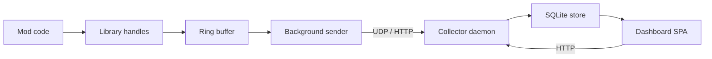

# Architecture

RimWorld Observability Collector spans three separate runtimes because each piece runs in a fundamentally different host environment.

## TL;DR

The system has three runtimes: a `net48` instrumentation library that runs inside RimWorld's Unity Mono process, a `netstandard2.0` shared wire-type library consumed by both sides, and a `net10` collector daemon that runs out-of-process. A MessagePack-framed UDP/HTTP protocol carries telemetry from the library to the collector, which stores it in SQLite and serves it through an embedded Svelte 5 SPA.

## The three runtimes

| Project | Target | Where it runs |
| --- | --- | --- |
| `RimObs.Library/` | net48 | Inside RimWorld's Unity Mono. Patches game code via Harmony. |
| `RimObs.Wire/` | netstandard2.0 | Shared MessagePack types. Linked from both Library and Collector. |
| `RimObs.Collector/` | net10.0 | Standalone daemon + CLI. Single self-contained binary per RID. |
| `RimObs.Dashboard/` | Svelte 5 + Vite | Static SPA. Built once, embedded as resource in `Collector.exe`. |

### `RimObs.Library/` (net48)

Runs inside RimWorld's Unity Mono. The target is `net48` because that is what RimWorld's bundled Mono runtime supports -- no other target is viable here.

The library's job is to be as invisible as possible. It applies Harmony IL transpilers to game methods at startup, writes measurements into a pre-allocated ring buffer, and drains that buffer via a background sender thread. The library allocates a fresh ephemeral port at bootstrap, then launches the collector child process, passing `--port 
` so both processes agree on which port to use.

Hot-path discipline is mandatory: zero allocation on the steady path, no locks, no `Task`/`async`, no string concatenation (PRD §11.6). Sections are registered by bare name; the library auto-prefixes each name with the mod's `packageId` (PRD §35.69).

### `RimObs.Wire/` (netstandard2.0)

A shared project that carries only MessagePack message types -- no logic, no runtime dependencies beyond the MessagePack library itself. The `netstandard2.0` target is necessary because the same assembly is consumed from `net48` (the library) and `net10` (the collector). It is also published separately as a NuGet package so third-party tool authors can encode and decode RimObs wire messages without taking a dependency on the full library or collector.

### `RimObs.Collector/` (net10.0)

A standalone daemon and CLI published as a single self-contained binary for four RIDs: `win-x64`, `linux-x64`, `osx-arm64`, `osx-x64`. It hosts the HTTP and UDP API on the same port, owns a SQLite database for session storage, and serves the embedded SPA from `/`.

### `RimObs.Dashboard/` (Svelte 5 + Vite)

A static SPA built once via `pnpm build`. The build output is embedded as a .NET `EmbeddedResource` in the Collector binary and served directly from memory -- no external file serving, no CDN dependency. The dashboard uses uPlot for time-series charts.

## Data flow

Data moves left to right: instrumented game code writes into pre-allocated handles, the ring buffer absorbs bursts, and a background sender thread drains the buffer over UDP or HTTP to the collector. The collector persists everything in SQLite. The dashboard reads from the collector's HTTP API and renders charts in the browser.

## Port allocation and collector lifecycle

The behavior depends on how the collector was launched.

**In-game (library-managed) launch:**

1. The library allocates a fresh ephemeral port at bootstrap.
2. It spawns the collector binary with `--port 
 --parent-pid <RimWorldPID>`.
3. HTTP and UDP both bind to that port.
4. The collector PID-watches the RimWorld process and self-exits when the game closes.
5. An idle-timeout fallback handles crashes where the PID disappears without a clean exit.
6. On startup the collector auto-opens the dashboard URL via `$BROWSER`.

**Standalone:**

Running `collector serve` without `--port` or `--parent-pid` uses the fixed port `17654` and runs until killed. This is the mode for CI, scripting, or loading saved session data outside of a running game.

This model supersedes PRD §35.71, which described a fixed-port + daemon-reuse approach. The ephemeral-port model avoids port conflicts when multiple RimWorld instances run simultaneously and gives the library full ownership of the collector's lifetime.

Time is measured via `Stopwatch.GetTimestamp()` with a session-start UTC anchor captured once at collector startup. All timestamps in the wire protocol and database are relative to that anchor and converted to wall-clock time on read (PRD §35.67).

## Mono compatibility constraint

The collector ships to `<mod>/Collector/<rid>/`, not `<mod>/Assemblies/Collector/<rid>/`.

RimWorld's `ModAssemblyHandler.ReloadAll` walks the `Assemblies/` directory recursively (`SearchOption.AllDirectories`) and attempts to load every `.dll` it finds into Unity Mono. Net10 assemblies use metadata features that crash Mono's custom-attribute reader (`MonoCustomAttrs`) with a SIGSEGV. Placing the collector under a sibling directory keeps it outside the recursion path entirely.

This overrides PRD §35.24 and §35.27, which document the older `Assemblies/Collector/<rid>/` layout. The `.claude/rules/project-overview.md` is the authoritative source for the current deployment layout.

The library itself (`RimObs.dll`) and `RimObs.Wire.dll` are both `net48` and deploy to `Assemblies/` as normal.

## Wire protocol

Telemetry batches are encoded with MessagePack. Each batch envelope carries a `schema_version` field so the collector can detect and reject batches from an incompatible library version. There is no compression -- the batches are small and the transport is loopback or LAN. See [Wire protocol](Wire-Protocol) for the full type catalog and field definitions.

Security: all mutating HTTP endpoints enforce an `Origin` header check (CSRF). The CLI authenticates via a bearer token in the `RIMOBS_TOKEN` environment variable (PRD §35.62, §35.28).

## Time source

All timing in the library uses `Stopwatch.GetTimestamp()` for nanosecond-resolution monotonic ticks. The collector captures a UTC wall-clock anchor at session start and uses it to convert ticks to absolute timestamps in query responses and exports. This avoids the cost and drift of `DateTime.UtcNow` on the hot path while preserving human-readable timestamps in the dashboard (PRD §35.67).

## Related

- [Wire protocol](Wire-Protocol)
- [Collector CLI](Collector-CLI)
- [Configuration](Configuration)
- [Using the collector](Using-The-Collector)
